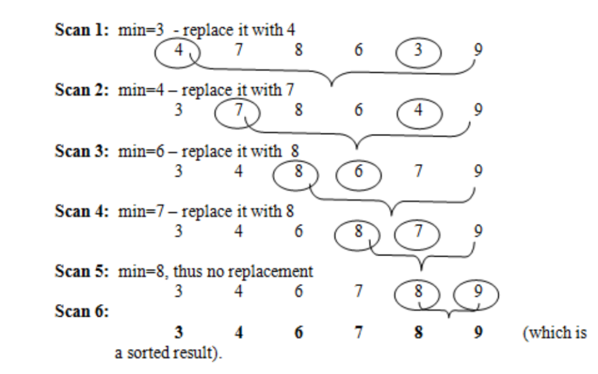
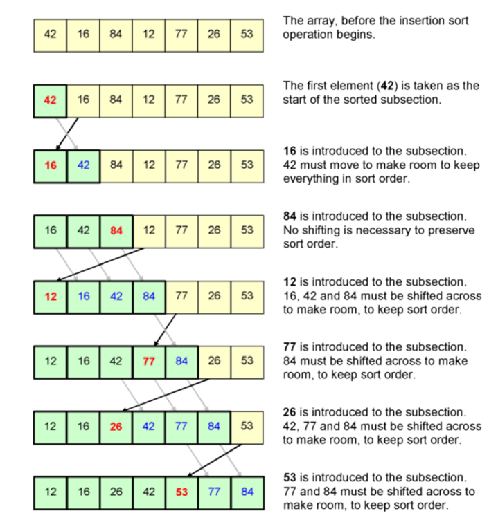
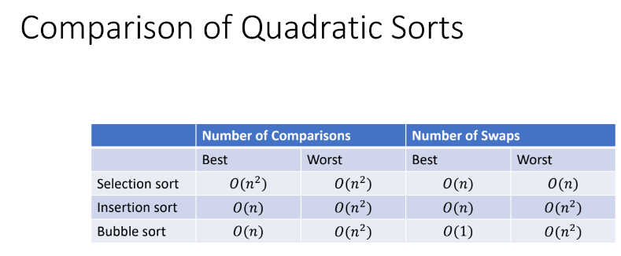

# Sorting Algorithms

## Selection sort

1. Array is imaginary divided into 2 parts (sorted & unsorted).
2. Sorted part is empty and unsorted one has the whole array.
3. In every step, find the minimum or maximum element in the unsorted part and add it to the end of sorted one.
4. When unsorted part becomes empty, the algorithm stops.

## Insertion sort

1. Array is imaginary divided into 2 parts (sorted & unsorted) just as selection sort.
2. sorted part contains the first element in the array, & unsorted has the rest of the array.
3. In every step, the algorithm takes the first element in the unsorted part then Inserts it in its right place in sorted part (by shifting elements to assure it's put in its right place).
4. Algorithm ends when unsorted part is empty.

## Bubble sort
1. Start at the beginning: Imagine you have an unsorted list of elements. Bubble sort starts by comparing the first two elements.
2. Compare and swap: If the first element is larger than the second element, they are swapped. This brings the larger element one step closer to the end of the list.
3. Move on: After comparing the first two elements, bubble sort moves on to compare the second and third elements. This continues until the end of the list is reached.
4. Repeat: Since some elements might still be out of order, the entire process (comparing and swapping adjacent elements) is repeated.
5. Bubbles Up: With each pass through the list, the largest element "bubbles up" to its correct position at the end of the list.
6. End when sorted: The algorithm continues looping through the list, making passes until no swaps are needed in a complete pass, indicating the list is sorted.

