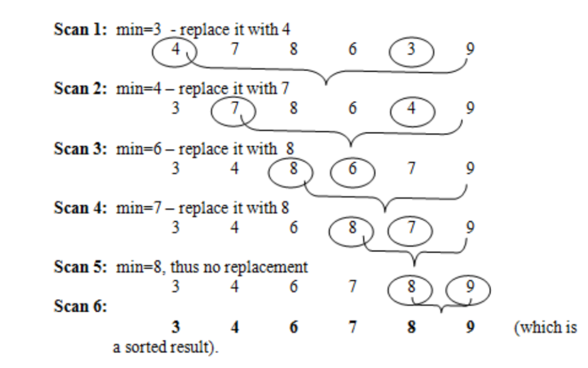
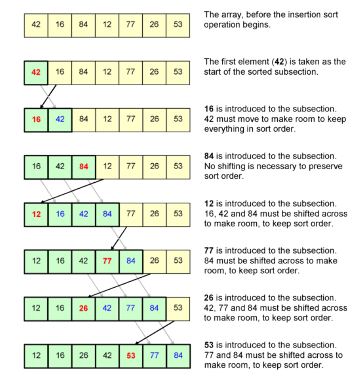
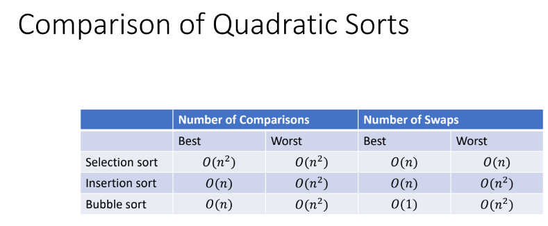
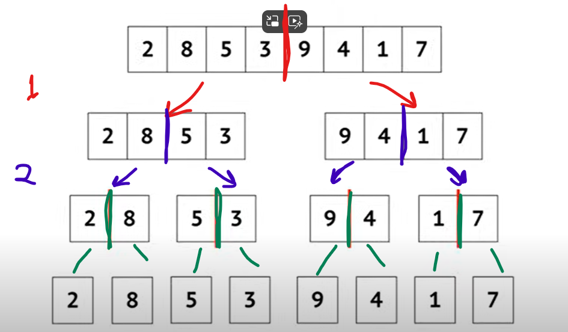
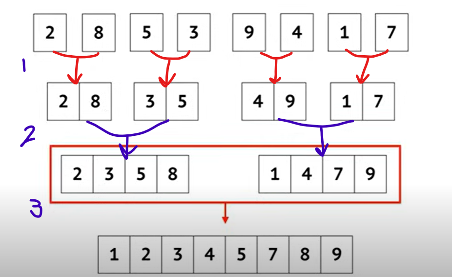

# Sorting Algorithms

## Selection sort

### Time Complexity: Best, Avg, Worst: N^2
### Memory: 1 (In place)

1. Array is imaginary divided into 2 parts (sorted & unsorted).
2. Sorted part is empty and unsorted one has the whole array.
3. In every step, find the minimum or maximum element in the unsorted part and add it to the end of sorted one.
4. When unsorted part becomes empty, the algorithm stops.

## Insertion sort

### Time Complexity: Best: N // Avg, Worst: N^2
### Memory: 1 (In place)

1. Array is imaginary divided into 2 parts (sorted & unsorted) just as selection sort.
2. sorted part contains the first element in the array, & unsorted has the rest of the array.
3. In every step, the algorithm takes the first element in the unsorted part then Inserts it in its right place in sorted part (by shifting elements to assure it's put in its right place).
4. Algorithm ends when unsorted part is empty.

## Bubble sort

### Time Complexity: Best, Avg, Worst: N^2
### Memory: 1 (In place)

1. Start at the beginning: Imagine you have an unsorted list of elements. Bubble sort starts by comparing the first two elements.
2. Compare and swap: If the first element is larger than the second element, they are swapped. This brings the larger element one step closer to the end of the list.
3. Move on: After comparing the first two elements, bubble sort moves on to compare the second and third elements. This continues until the end of the list is reached.
4. Repeat: Since some elements might still be out of order, the entire process (comparing and swapping adjacent elements) is repeated.
5. Bubbles Up: With each pass through the list, the largest element "bubbles up" to its correct position at the end of the list.
6. End when sorted: The algorithm continues looping through the list, making passes until no swaps are needed in a complete pass, indicating the list is sorted.

## Shell sort (Improved insertion sort)

1. Gaps and sub-lists: Shell sort introduces the concept of a gap. It starts with a large gap value and repeatedly sorts sub-lists of elements separated by that gap. The idea is to take advantage of the larger distance between elements to move them closer to their sorted positions more efficiently.

2. Sorting sub-lists: Shell sort iterates through the list, considering elements separated by the current gap. For each gap value, it performs an insertion sort on these sub-lists. This allows elements to "jump" larger distances in the list, reducing disorder more quickly.

3. Shrinking the gap: After a pass with the current gap, the gap value is reduced (typically divided by a factor like 2 or 3). This process continues until the gap becomes 1, essentially performing a normal insertion sort on the entire list.

4. Effectively moving elements: By using larger gaps initially, shell sort can move elements that are far apart in the list more efficiently compared to just shifting them by one position like in insertion sort. This reduces the number of swaps needed in the later stages with smaller gaps.

## Merge sort

### Time Complexity: Best, Avg, Worst: N log(N)

### Memory: N (Not in place)

1. Part 1: divide the array like this:
   
2. Part 2: sort then merge:
   

## Quick sort

### Time Complexity: Best, Avg: N log(N) // Worst: N^2.
### Memory: 1 (in place)
1. 

## Count sort

### Time Complexity: Best, Avg, Worst: N
### Memory: N (not in place)

1. First, you need to determine the highest value (maximum) in the array
2. Make an array (often called the "count array") with a size equal to the maximum value you found in step 1 plus 1. This extra space is because you'll be using the index of this array to store the count of each element.
3. Initialize all the values in the count array to 0.
4. Iterate through the original array, & for each element increment the corresponding index in the count array by 1. This means that count[arr[i]]++ will increment the count for the element found at index i in the original array.
5. Iterate through the count array from second element to the end. For each index, add the count at the previous index to current count. This creates a running total of element counts (count[i] += count[i - 1]).
6. Allocate a new array (often called the "output array") with the same size as the original array. This will store the sorted elements.
   Iterate through the original array in reverse order (from the last element to the first). For each element, use the value in the count array as an index to place the element in the output array. Decrement the count at that index in the count array to prepare for the next element with the same value (ensures stability if multiple elements have the same value).

## Radix sort

1. sort based on bits.
2. start by least significant bit & sort based on it.
3. move to the next bit and sort.
4. keep repeating steps 2 & 3 till you reach the end.
5. You will have sorted list by the end.

## Bucket sort

1. It creates a fixed number of empty buckets.
   Each element from the unsorted list is then distributed into its designated bucket based on some criteria. This criteria often involves a mapping function that determines the appropriate bucket for an element's value.
2. Once all elements are scattered into their respective buckets, each bucket is independently sorted using a separate sorting algorithm. A simple sorting algorithm like insertion sort is often chosen for this step due to the typically smaller size of elements within each bucket.
3. Finally, the sorted elements from each bucket are combined sequentially to form the final sorted list.
